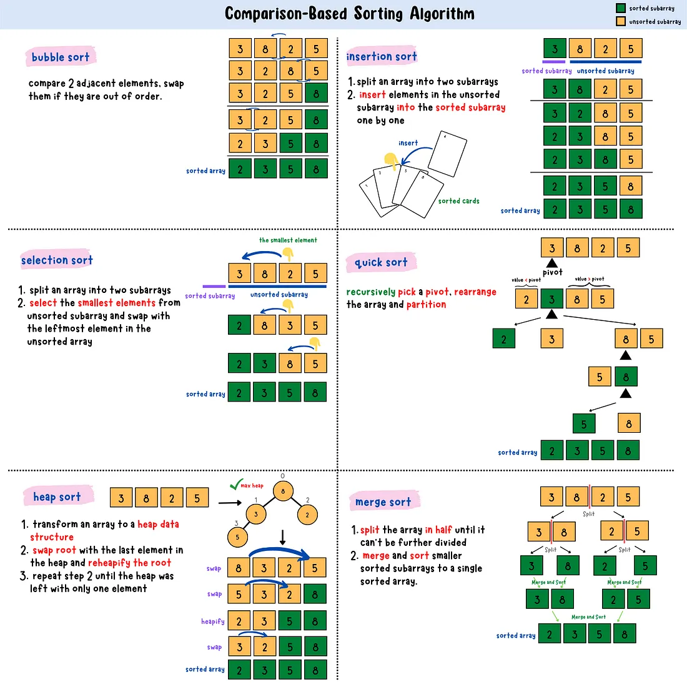
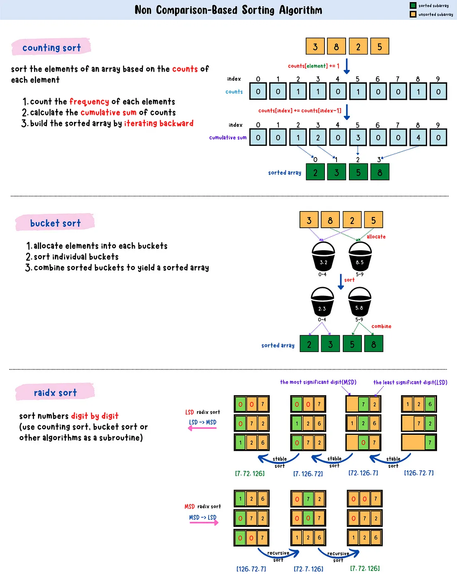
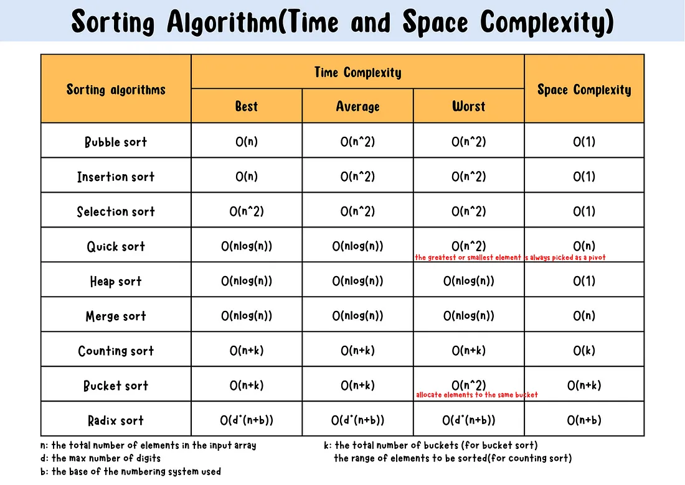

Here is a list of all the major sorting algorithms implemented in Python, grouped by category, with basic examples:

---

### **1. Comparison-based Sorting Algorithms**



#### a. **Bubble Sort**

```python
def bubble_sort(arr):
    n = len(arr)
    for i in range(n):
        for j in range(n - i - 1):
            if arr[j] > arr[j + 1]:
                arr[j], arr[j + 1] = arr[j + 1], arr[j]
    return arr
```

#### b. **Selection Sort**

```python
def selection_sort(arr):
    for i in range(len(arr)):
        min_idx = i
        for j in range(i + 1, len(arr)):
            if arr[j] < arr[min_idx]:
                min_idx = j
        arr[i], arr[min_idx] = arr[min_idx], arr[i]
    return arr
```

#### c. **Insertion Sort**

```python
def insertion_sort(arr):
    for i in range(1, len(arr)):
        key = arr[i]
        j = i - 1
        while j >= 0 and key < arr[j]:
            arr[j + 1] = arr[j]
            j -= 1
        arr[j + 1] = key
    return arr
```

#### d. **Merge Sort**

```python
def merge_sort(arr):
    if len(arr) > 1:
        mid = len(arr) // 2
        L = merge_sort(arr[:mid])
        R = merge_sort(arr[mid:])

        return merge(L, R)
    return arr

def merge(L, R):
    result = []
    i = j = 0
    while i < len(L) and j < len(R):
        if L[i] < R[j]:
            result.append(L[i])
            i += 1
        else:
            result.append(R[j])
            j += 1
    result += L[i:]
    result += R[j:]
    return result
```

#### e. **Quick Sort**

```python
def quick_sort(arr):
    if len(arr) <= 1:
        return arr
    pivot = arr[0]
    less = [x for x in arr[1:] if x <= pivot]
    greater = [x for x in arr[1:] if x > pivot]
    return quick_sort(less) + [pivot] + quick_sort(greater)
```

#### f. **Heap Sort**

```python
def heap_sort(arr):
    import heapq
    heapq.heapify(arr)
    return [heapq.heappop(arr) for _ in range(len(arr))]
```

#### g. **Shell Sort**

```python
def shell_sort(arr):
    n = len(arr)
    gap = n // 2
    while gap > 0:
        for i in range(gap, n):
            temp = arr[i]
            j = i
            while j >= gap and arr[j - gap] > temp:
                arr[j] = arr[j - gap]
                j -= gap
            arr[j] = temp
        gap //= 2
    return arr
```

---

### **2. Non-comparison-based Sorting Algorithms**


#### a. **Counting Sort** (only for non-negative integers)

```python
def counting_sort(arr):
    max_val = max(arr)
    count = [0] * (max_val + 1)
    for num in arr:
        count[num] += 1
    result = []
    for i, c in enumerate(count):
        result.extend([i] * c)
    return result
```

#### b. **Radix Sort**

```python
def radix_sort(arr):
    RADIX = 10
    max_length = len(str(max(arr)))
    for exp in range(max_length):
        buckets = [[] for _ in range(RADIX)]
        for num in arr:
            buckets[(num // RADIX ** exp) % RADIX].append(num)
        arr = [num for bucket in buckets for num in bucket]
    return arr
```

#### c. **Bucket Sort**

```python
def bucket_sort(arr):
    if not arr:
        return arr
    bucket_count = len(arr)
    min_val, max_val = min(arr), max(arr)
    buckets = [[] for _ in range(bucket_count)]
    for num in arr:
        index = int((num - min_val) / (max_val - min_val + 1) * bucket_count)
        buckets[index].append(num)
    sorted_arr = []
    for bucket in buckets:
        sorted_arr.extend(sorted(bucket))  # use any other sort
    return sorted_arr
```

#### **Time Complexity**


---